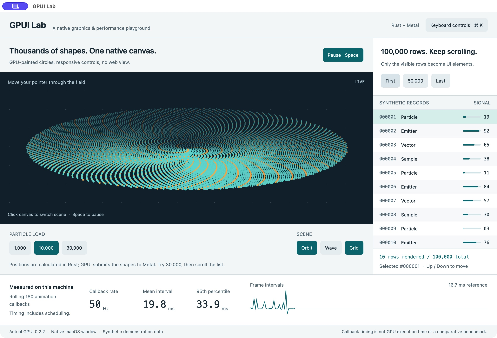

# GPUI Lab

A real, native macOS application written in Rust with GPUI 0.2.2. It demonstrates GPU painting, virtualized lists, reactive state, and keyboard action dispatch in one running window.

## Run

Double-click `launch.command`, or run `cargo run --locked` from this directory. After the first build, open `GPUI Lab.app` directly. The launcher creates that app bundle. Rust and Xcode command line tools are required to rebuild; no Node.js or browser runtime is used.

The published GPUI version is pinned and Cargo.lock is included. The `font-kit` feature enables actual macOS text rendering; disabling default features without restoring it selects a no-op text renderer. This was built with Rust 1.89. GPUI's `runtime_shaders` feature compiles its Metal shaders at startup, avoiding the optional Xcode Metal compiler download. This configuration targets macOS.

## Try it

1. Move the pointer through the animated field: nearby particles move aside.
2. Select **30,000** particles and keep scrolling the record list. The list contains 100,000 synthetic records but only builds the visible rows.
3. Switch between **Orbit** and **Wave**. The circles and interface text are drawn by GPUI; positions are computed on the CPU in Rust.
4. Jump directly to row 50,000 or the last row. The footer reports the actual range size requested by GPUI's list renderer.
5. Press **Space** to pause, **S** to change scene, **G** to toggle the grid, **[ / ]** to adjust load, or **Cmd K** to see the controls. **J** jumps to row 50,000; **Up / Down** changes selection; **Home / End** moves to the first / last row.

## What this demonstrates

| Experiment | GPUI mechanism | Why it matters |
| --- | --- | --- |
| Animated circles | `canvas`, `Window::paint_layer`, `Window::paint_quad`, Metal renderer | Custom drawing can coexist with ordinary UI without a browser bridge. |
| 100,000 synthetic records | `uniform_list`, `UniformListScrollHandle` | The element count scales with the visible viewport, not the entire data set. |
| Live controls | `Entity<Lab>`, `Render`, `Context::notify` | Retained Rust state is rendered through a declarative element tree. |
| Keyboard controls | `actions!`, `KeyBinding`, focus and key context | Mouse and keyboard operations work with the same state. |
| Timing trace | `Window::on_next_frame`, `Instant` | Timing comes from actual callback intervals, not an invented FPS number. |

These features are not exclusive to GPUI. Its distinctive combination is native GPU rendering, Rust ownership, declarative composition and low-level drawing control—the same general foundation used by Zed.

## Where performance comes from

GPUI can spend less CPU time preparing a frame by using a focused native rendering pipeline. Its application logic runs as compiled Rust without a tracing garbage collector, and specialized GPU shaders draw common UI primitives. Text shaping and glyph caching avoid repeating expensive work for unchanged text. See [Zed's rendering architecture](https://zed.dev/blog/videogame).

This demo also makes two deliberate choices: 30,000 particles are paint commands inside one canvas rather than 30,000 independently laid-out widgets, and the 100,000-record list builds only the requested visible rows. Both techniques are available in other frameworks. Particle positions are still calculated on the CPU; GPU painting does not make that work free.

GPU acceleration alone does not establish an advantage: [Chromium](https://developer.chrome.com/docs/chromium/renderingng-architecture) and [Flutter](https://docs.flutter.dev/perf/impeller) also use the GPU. Relative to DOM-heavy interfaces, GPUI offers a way to avoid browser layout and runtime overhead. Against an optimized native renderer or WebGPU canvas, the result depends on the workload and implementation.

This repository contains no equivalent implementation in another framework, so it does not establish a speedup. A useful comparison would match the visuals, particle calculations, list virtualization, window size, hardware, and build optimization, then measure CPU/GPU time, memory, input latency, and slow frames. Use `cargo run --release --locked` for the GPUI side of such a comparison, and distinguish callback timing from actual presentation timing.

## Understand the measurements

The trace records wall-clock intervals between animation callbacks. It reports `1000 / mean_interval` in Hz, mean interval, and nearest-rank 95th percentile over the last 180 samples. It includes scheduling delays and slow frames. The 16.7 ms line is a reference for 60 Hz, not a target the application guarantees. The vertical scale expands to include the slowest retained sample.

This is **not GPU execution timing, a count of frames actually presented, or a controlled performance comparison**. Display refresh rate, window occlusion, other apps, capture tools, build settings and OS scheduling affect results. The provided executable uses an optimized development build (app level 1, dependencies level 2). Pausing retains the previous measurements and stops scheduling animation; resuming skips the paused interval. Changing particle count clears measurement history.

The particle quads share one paint layer, which avoids a separate bounds-tree insertion for every particle. GPUI retains quad insertion order within the batch. The particles are procedural graphics, not a GPU compute simulation. Record values are deterministic synthetic examples, not live telemetry. This prototype does not implement text editing, a full component library, or production accessibility. The controls have keyboard shortcuts; platform screen-reader support has not been established.

## Source map

- `src/main.rs`: window, paint commands, list, controls, timing and keyboard actions.
- `src/simulation.rs`: procedural positions and measurement summaries, with unit tests.
- `Cargo.toml` and `Cargo.lock`: pinned framework and dependency resolution.
- `launch.command` and `Info.plist`: local macOS launchable app packaging.

Verify with `cargo test --locked` and `cargo fmt --check`.

## Read more

- [GPUI official site](https://gpui.rs/)
- [GPUI 0.2.2 API and architecture](https://docs.rs/gpui/0.2.2/gpui/)
- [Zed: rendering interfaces on the GPU](https://zed.dev/blog/videogame)

GPUI is pre-1.0 and its API can change between releases.
